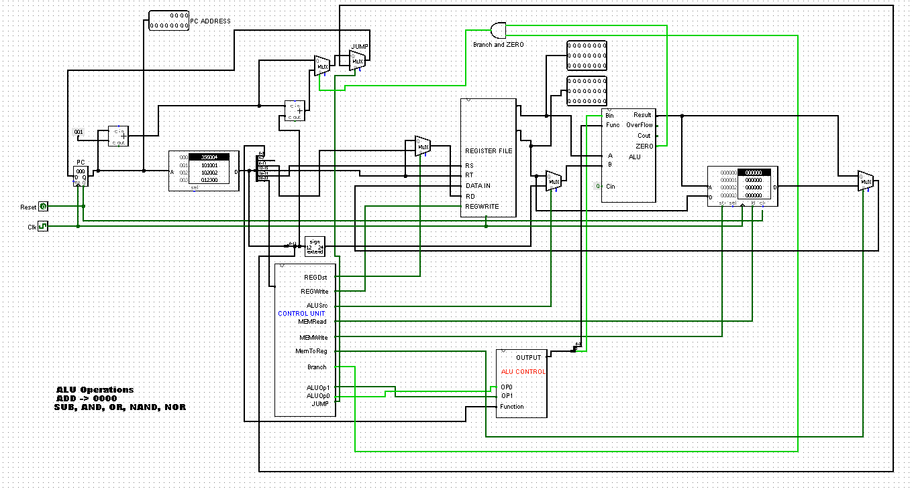

# 24BitMipsArchitecture

A 24 bit MIPS Architecture.

This is part of a project done for CSE332 course at NSU. The main circuit 24BitMipsArchitecture contains the full circuit for a working version of mips that works with 24 bit instructions. Implementation details are given in the report file.

The other circuits are different parts of a MIPS system.

Find the details [Here](InstructionSet.odt "Mips Architecture")